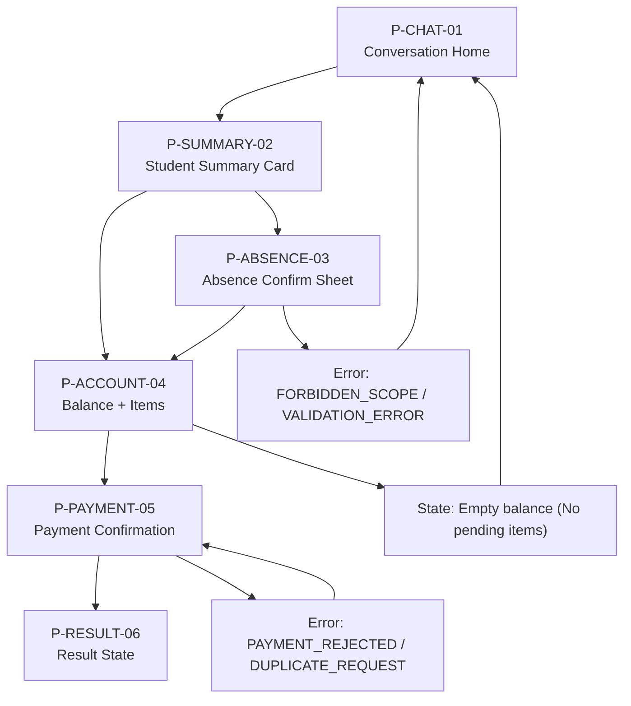

# Journey P0 Completo — Parent (Summary + Absence + Payment)

## Scope
- Profile: `Parent/Tutor`
- Channels: `WhatsApp`, `App`, `Web`
- Objective: Resolve 3 core needs in one session:
1. Check student status
2. Report absence
3. Pay pending balance

Tools used:
- `get_student_summary@v1`
- `record_absence@v1`
- `get_account_status@v1`
- `process_payment@v1`

---

## Entry Conditions
- User authenticated as `P`.
- User has at least one linked student.
- Family billing account exists.

---

## End-to-End Flow (Happy Path)

1. User opens chat and asks: "How is Mateo doing this week?"
- UI: Chat + quick chips (`Attendance`, `Grades`, `Tasks`, `Pay due`).
- System: call `get_student_summary@v1`.
- Output: attendance, recent grades, pending tasks.

2. Assistant returns summary and surfaces proactive note.
- Example note: "You also have 1 overdue invoice." (if any)
- CTA: `Report absence`, `View account`.

3. User says: "He won’t attend tomorrow."
- System asks disambiguation if multiple children.
- System asks confirmation of date/reason.

4. User confirms absence details.
- System call: `record_absence@v1` with `idempotency_key`.
- Output: `success`, `recorded_absences`, `notifications_sent`.
- UI: success toast + chat confirmation.

5. Assistant proposes payment flow.
- Prompt: "Do you want to pay the overdue item now?"
- User accepts.

6. System fetches account details.
- Call: `get_account_status@v1`.
- UI: itemized balance card with checkbox selection.

7. User selects items and confirms payment.
- System must request explicit confirmation.
- Call: `process_payment@v1` with `explicit_confirmation=true` and `idempotency_key`.

8. Payment result displayed.
- Success: transaction id + receipt URL + updated balance hint.
- Assistant closes with next action: "Need anything else for tomorrow?"

---

## Screen/Wireflow Map

1. `P-CHAT-01` Conversation Home
- Blocks: last messages, quick actions, pending alerts.
- Primary CTA: ask in natural language.

2. `P-SUMMARY-02` Student Summary Card
- Sections: attendance, grades, tasks.
- Secondary CTA: `Report absence`, `View account`.

3. `P-ABSENCE-03` Absence Confirm Sheet
- Fields: student, date, reason.
- CTA: `Confirm absence`.

4. `P-ACCOUNT-04` Balance + Items
- Fields: pending items list, due dates, totals.
- CTA: `Proceed to payment`.

5. `P-PAYMENT-05` Payment Confirmation
- Fields: selected items, total amount, payment method.
- CTA: `Pay now` (explicit confirmation).

6. `P-RESULT-06` Result State
- Success: receipt + transaction id.
- Failure: retry/change method/support.

---

## Visual Wireflow (Mermaid)

---

## Critical States

For each step include:
- `loading`
- `empty`
- `error`
- `permission_denied`

Specific critical states:
- Multiple children ambiguity -> require student selection.
- No pending balance -> disable payment CTA.
- Duplicate action (`DUPLICATE_REQUEST`) -> show previous result, block duplicate charge.
- Payment rejection (`PAYMENT_REJECTED`) -> offer retry and alternate method.

---

## Error & Fallback Handling

- `FORBIDDEN_SCOPE`
: "I can only access your linked students/family account."

- `DATA_UNAVAILABLE`
: show partial response + retry CTA.

- `CONFIRMATION_REQUIRED`
: block action until explicit user yes.

- `OPTIN_REQUIRED` (outbound only)
: not expected in this journey, but keep generic handler.

---

## UX Rules

- Conversation-first: no forced navigation maze.
- One primary CTA per step.
- Plain language, no institutional jargon.
- Confirm risky actions (absence registration + payment).
- Keep all technical fields hidden from end user.

---

## Metrics

- `TTR` (time to resolve full journey) < 3 min
- `Summary success rate` > 95%
- `Absence first-pass success` > 98%
- `Payment completion rate` > 75%
- `Duplicate payment incidents` = 0

---

## Build Checklist

- [ ] Wireframes created for `P-CHAT-01` to `P-RESULT-06` (mobile + web)
- [ ] All critical states represented
- [ ] All tool calls mapped to step ids
- [ ] Copy approved for confirmation dialogs
- [ ] QA script includes error codes and retries
